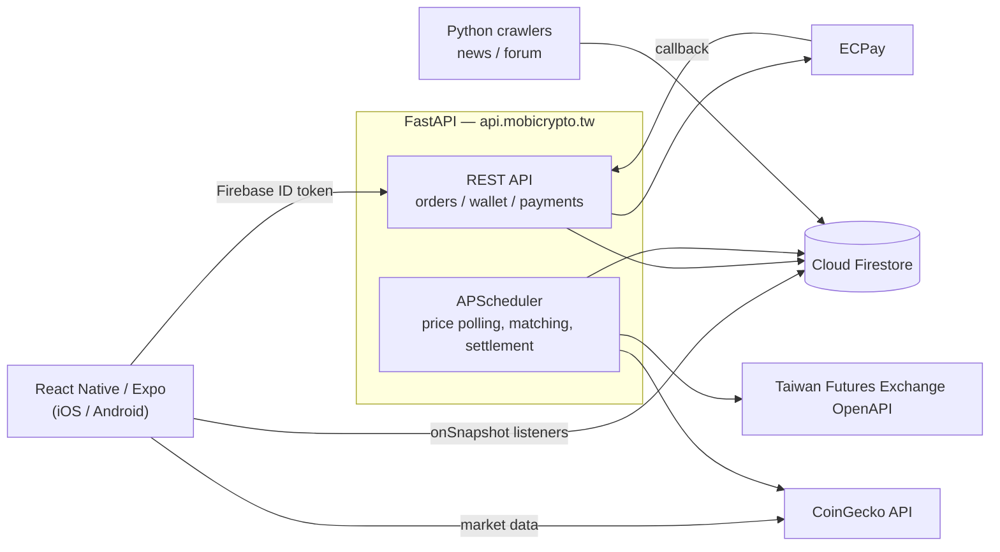

# MOBI — Cryptocurrency Paper-Trading Mobile Platform

A React Native application that lets users experience cryptocurrency trading without risking real money.
The project covers real-time market data, limit and market order matching, copy trading, and credit card
payment integration — a full-stack team project spanning mobile client through backend services.

[日本語](README.md) | [繁體中文](README.zh-TW.md) | **English**

> Fu Jen Catholic University, Dept. of Information Management — 38th senior project (Sep 2021 – Jun 2022)
> This repository is archived. The backend server and Firebase project are no longer running.

---

## Screenshots

| Home | Market List | Coin Detail & Fill |
|:---:|:---:|:---:|
|  |  |  |
| Top coins, monthly leaderboard,<br>copy-trading suggestions | Live prices, daily high/low,<br>and sparklines | Price chart, order book,<br>and market-order fill notice |

| Portfolio | Copy Trading | ECPay Checkout |
|:---:|:---:|:---:|
|  |  |  |
| Allocation pie chart, unrealized<br>P&L, average cost basis | Trader performance and<br>open positions | Real credit card payment<br>(production environment) |

---

## Overview

Unlike equities, cryptocurrency markets trade around the clock, which makes them a high-barrier,
high-risk entry point for newcomers. This project builds a **simulator that tracks real market prices
while trading exclusively in virtual funds**, so users can accumulate trading experience at zero cost.

New users receive 150,000 TWD in virtual funds, topped up by watching ads or making a purchase.
Beyond basic buy/sell functionality, the system centers on **copy trading** — automatically mirroring
another user's trades — so beginners can learn how more experienced traders make decisions.

---

## Tech Stack

| Area | Technology |
|---|---|
| Mobile app | React Native 0.64 / Expo SDK 44 / React Navigation 6 |
| Charts & UI | react-native-svg-charts / react-native-vector-icons / react-native-toast-message |
| Authentication | Firebase Authentication |
| Database | Cloud Firestore (NoSQL) |
| Backend API | Python 3.10 / FastAPI / Uvicorn (with TLS termination) |
| Scheduling | APScheduler |
| Payments | ECPay credit card payments |
| External data | CoinGecko API (250 coins) / Taiwan Futures Exchange OpenAPI (FX rates) |
| Crawlers | Requests + BeautifulSoup (news and forum posts) |
| Ads | Google AdMob |

### Architecture



Every **write that moves assets goes through FastAPI**, keeping order processing and balance arithmetic on the
server. Each request is authorized by verifying a Firebase ID token first.

Account balance, holdings, open orders, and trade history, on the other hand, are **watched with Firestore
`onSnapshot` listeners** on the client. Limit-order fills (matched by a scheduler every 30 seconds) and mirrored
copy-trading orders **change a user's assets asynchronously on the server, without any action from that user** —
listeners push those changes to the screen immediately, with no polling or manual refresh. It also means the API
only has to write to Firestore; it never needs to return the updated state in its response.

Market data comes from an external API with no change notifications, so the client polls CoinGecko at per-screen intervals
(coin detail every 4 s, market list every 10 s, home every 15 s, with timers cleared when the screen unmounts).
The backend polls the same API every 6 seconds for order matching.

---

## Features

### Trading
- **Market and limit orders** (buy/sell) — size by a percentage slider against available funds, or enter quantity directly
- **Order matching** — a job scans open limit orders every 30 seconds, fills those meeting the price condition, and recalculates average cost
- **Order management** — list and cancel open orders
- **Order book** — 5 price levels, plus 24h high/low/volume/change
- **Price chart** — daily price history rendered with SVG

### Copy Trading (core feature)
- Traders publish **follower count, trade count, weekly/monthly ROI, win/loss record, and total return**
- Review a trader's **current positions** and **trade history** before following
- Two follow modes — **fixed ratio** and **fixed cap** — with mid-flight ratio changes and unfollowing
- When a followed trader's order fills, a corresponding order is generated in each follower's account
- **Fund transfers** into a dedicated copy-trading sub-account

### Portfolio
- Holdings **pie chart**, total spot value, unrealized P&L, average cost basis
- **Trade history** filterable by last 12h / 1 day / 3 days / all; sells also show realized P&L and ROI
- Automatic **daily, weekly, and monthly settlement**

### Funding
- **Ad rewards** for virtual funds (up to 10 per day)
- **ECPay credit card top-ups** — real charges in production, credited via callback

### Other
- Email **sign-up / login / password reset**
- Per-coin **notes** and **watchlist**
- Home feed with **top-volume coins, monthly P&L leaderboard, news, and forum posts**
- Profile editing and issue reporting

---

## My Contribution

I was responsible for the following areas.

| Area | Scope | Details |
|---|:---:|---|
| Frontend | **All** | All 18 screens in React Native, navigation design with React Navigation, state management, API integration |
| Database | **All** | Firestore data modeling, collection structure, query implementation |
| Backend | **Partial** | See below |
| UI design | Not mine | Visual design and image assets were handled by other members |

Backend areas I owned:

- **Crawlers** — scraping news sites and forum posts into Firestore
- **Price & FX data** — scheduled polling of the CoinGecko API (250 coins) and the Taiwan Futures Exchange OpenAPI
- **Market buy orders** — end-to-end from order intake to balance update
- **Wallet & rewards** — fund transfers, ad rewards, subsidies, login rewards
- **Payments** — ECPay order creation, CheckMacValue handling, callback processing
- **Copy trading** — follow evaluation, mirrored order generation, unfollow handling
- **ROI calculation** — return-on-investment and P&L logic

---

## Project Structure

```
.
├── App.js                      # Entry point / navigation
├── pages/                      # Screen components (18 screens)
│   ├── HomeScreen.js           #   Home
│   ├── TargetScreen.js         #   Market list
│   ├── BillingScreen.js        #   Ledger (orders, holdings, copy trading)
│   ├── WalletScreen.js         #   Wallet
│   ├── ProfileScreen.js        #   Profile
│   ├── account/                #   Login, sign-up, password reset, edit
│   ├── billing/                #   Trade history, transfer, top-up, copy trading
│   ├── profile/                #   Watchlist, notes
│   └── target/                 #   Coin detail, trade menu
├── assets/                     # Styles, shared helpers, Firebase init, images
├── fastapi/                    # Backend API server
│   ├── main.py                 #   13 endpoints + APScheduler jobs
│   ├── server.py               #   Uvicorn entry (TLS)
│   ├── https_redirect.py       #   HTTP → HTTPS redirect
│   ├── sdk/                    #   ECPay payment SDK
│   └── requirements.txt
├── py/ , py_on_server/         # News and forum crawlers
└── docs/screenshots/
```

---

## API Endpoints

| Method | Path | Description |
|---|---|---|
| `POST` | `/buy/{type}` | Buy order (`market` / `limit`) |
| `POST` | `/sell/{type}` | Sell order (`market` / `limit`) |
| `POST` | `/del_tran` | Cancel an open order |
| `POST` | `/transfer` | Transfer funds to the copy-trading account |
| `POST` | `/cancel_copy_trade` | Stop following a trader |
| `POST` | `/receive_award` | Claim login reward |
| `POST` | `/ad_reward` | Claim ad-watch reward |
| `POST` | `/subvention` | Claim subsidy |
| `POST` | `/exchange_rate` | Fetch FX rate |
| `GET` | `/get_payment_html/` | Generate the ECPay checkout form |
| `POST` | `/ecpay_callback` | Receive ECPay payment result |

Scheduled jobs (APScheduler):

| Interval | Job |
|---|---|
| 6 s | Poll CoinGecko for 250 coin prices |
| 30 s | Scan open limit orders and fill those meeting their price condition |
| 1 min | Poll the Taiwan Futures Exchange OpenAPI for FX rates |
| Daily / weekly / monthly | Settle P&L and compute leaderboards |

---

## Setup

Running this requires your own Firebase project and ECPay merchant account.
No credentials are included in this repository.

### Mobile app

```bash
npm install --legacy-peer-deps
npx expo start
```

Replace the Firebase configuration in `assets/database.js` with your own project's values.

### Backend

```bash
cd fastapi
pip install -r requirements.txt
cp ../.env.example .env    # fill in each value
python server.py
```

See [`.env.example`](.env.example) for the required environment variables:

| Variable | Purpose |
|---|---|
| `FIREBASE_CREDENTIALS` | Path to the Firebase Admin SDK service account key |
| `ECPAY_MERCHANT_ID` / `ECPAY_HASH_KEY` / `ECPAY_HASH_IV` | ECPay merchant credentials |
| `SSL_KEYFILE` / `SSL_CERTFILE` | TLS certificate (when terminating HTTPS in Uvicorn) |

---

## Notes and Limitations

- This repository is an **archive of the code as of 2022**. The backend (`api.mobicrypto.tw`) and the Firebase project are no longer running.
- Expo SDK 44 and React Native 0.64 are both end-of-life; running the app requires Node 16.
- Before publishing, all **service account keys, payment keys, and TLS private keys** that had been hardcoded were removed and replaced with environment variables.
- `py/` and `py_on_server/` are the per-developer local copies of the crawler scripts as they existed during development.

---

## License

[MIT License](LICENSE)
