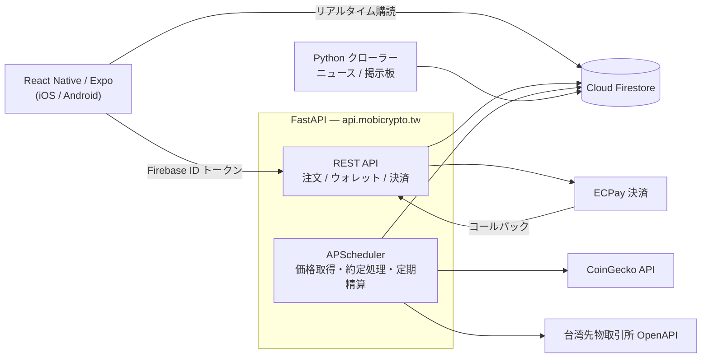

# MOBI（模幣）— 仮想通貨モバイル模擬取引プラットフォーム

実資金を使わずに仮想通貨取引を体験できる、React Native 製のモバイルアプリケーション。
リアルタイム相場の取得、指値・成行注文の約定処理、コピートレード、クレジットカード決済までを実装した、
フロントエンドからバックエンドまで一貫したチーム開発プロジェクトです。

**日本語** | [繁體中文](README.zh-TW.md) | [English](README.en.md)

> 輔仁大学 情報管理学科 第38期 卒業制作（2021年9月 – 2022年6月）
> 本リポジトリはアーカイブです。バックエンドサーバーおよび Firebase プロジェクトは現在稼働していません。

---

## スクリーンショット

| ホーム | 銘柄一覧 | 銘柄詳細・約定 |
|:---:|:---:|:---:|
|  |  |  |
| 主要銘柄・月間ランキング・<br>コピートレード推薦 | 現在値・高値/安値と<br>ミニチャートの一覧 | 価格チャート・板情報と<br>成行注文の約定通知 |

| ポートフォリオ | コピートレード | ECPay 決済 |
|:---:|:---:|:---:|
|  |  |  |
| 保有比率の円グラフ・<br>未実現損益・平均取得単価 | トレーダーの成績と<br>現在ポジションの公開 | クレジットカードによる<br>実決済（本番環境） |

---

## 概要

株式と異なり 24 時間取引が続く仮想通貨市場は、初心者にとって参入障壁とリスクが高い領域です。
本プロジェクトでは、**実際の市場価格に連動しながら仮想資金のみで取引を行えるシミュレーター**を構築し、
ユーザーがコストゼロで取引経験を蓄積できる環境を提供することを目的としました。

新規ユーザーには仮想資金 150,000 TWD が配布され、広告視聴または課金によって追加資金を得られます。
単なる売買機能にとどまらず、**他ユーザーの取引を自動追従するコピートレード機能**を中核に据え、
初心者が上級者の投資判断を学習できる設計としています。

---

## 技術構成

| 領域 | 使用技術 |
|---|---|
| モバイルアプリ | React Native 0.64 / Expo SDK 44 / React Navigation 6 |
| チャート・UI | react-native-svg-charts / react-native-vector-icons / react-native-toast-message |
| 認証 | Firebase Authentication |
| データベース | Cloud Firestore（NoSQL） |
| バックエンド API | Python 3.10 / FastAPI / Uvicorn（TLS 終端込み） |
| 定期実行 | APScheduler |
| 決済 | ECPay（綠界科技）クレジットカード決済 |
| 外部データ | CoinGecko API（250 銘柄の価格）/ 台湾先物取引所 OpenAPI（為替レート） |
| クローラー | Requests + BeautifulSoup（ニュース・掲示板記事） |
| 広告 | Google AdMob |

### システム構成



クライアントは相場や保有状況の**参照を Firestore のリアルタイム購読で直接行い**、
資産が変動する**書き込み操作はすべて FastAPI 経由**とすることで、注文処理と残高計算をサーバー側に集約しています。
各リクエストは Firebase ID トークンを検証してから処理されます。

---

## 主な機能

### 取引
- **成行注文 / 指値注文**（買い・売り）— 保有資金に対する割合をスライダーで指定、または数量を直接入力
- **約定処理** — 30 秒ごとに未約定の指値注文を走査し、価格条件を満たしたものを約定。平均取得単価を再計算
- **注文管理** — 未約定注文の一覧表示と取消
- **板情報** — 5 段の気配値表示、24 時間の高値・安値・出来高・騰落率
- **価格チャート** — 日次の価格推移を SVG で描画

### コピートレード（本システムの中核機能）
- トレーダーの**追跡人数・取引件数・週次/月次利回り・勝敗数・総収益**を公開
- **現在ポジション**と**過去の取引履歴**を確認したうえで追従を判断
- 追従モードは**固定比率**と**固定上限**の 2 種類、追従中の比率変更・解除にも対応
- 追従元の注文が約定すると、追従者の口座でも自動的に対応する注文を生成
- コピートレード専用口座への**資金振替**機能

### 資産管理
- 保有銘柄の**円グラフ**、現物総評価額、未実現損益、平均取得単価
- **取引履歴**を直近半日・1 日・3 日・全期間で絞り込み、売却時は実現損益と投資利回りを併記
- 日次・週次・月次の**自動精算処理**

### 資金調達
- **広告視聴**による仮想資金の獲得（1 日 10 回まで）
- **ECPay クレジットカード決済**による課金（本番環境で実決済、コールバックで残高反映）

### その他
- メールアドレスによる**新規登録 / ログイン / パスワード再設定**
- 銘柄ごとの**メモ機能**、**お気に入り登録**
- ホーム画面での**出来高上位銘柄・月間損益ランキング・ニュース・掲示板記事**の表示
- プロフィール編集、不具合報告

---

## 担当範囲

本人の担当範囲は以下のとおりです。

| 領域 | 担当 | 内容 |
|---|:---:|---|
| フロントエンド | **全般** | 全 18 画面の React Native 実装、React Navigation による画面遷移設計、状態管理、API 連携 |
| データベース | **全般** | Firestore のデータモデル設計、コレクション構成、クエリ実装 |
| バックエンド | **一部** | 下記参照 |
| UI デザイン | 担当外 | 画面デザイン・画像素材は他メンバーが担当 |

バックエンドの担当箇所：

- **クローラー** — ニュースサイト・掲示板記事の取得と Firestore への投入
- **価格・為替レート取得** — CoinGecko API（250 銘柄）と台湾先物取引所 OpenAPI の定期取得
- **成行買い注文** — 注文受付から残高更新までの処理
- **ウォレット・報酬** — 資金振替、広告報酬、補助金、ログイン報酬
- **決済** — ECPay の注文生成、CheckMacValue 処理、コールバック受信
- **コピートレード** — 追従判定と注文連動、追従解除処理
- **ROI 計算** — 投資利回りおよび損益の算出ロジック

---

## ディレクトリ構成

```
.
├── App.js                      # エントリポイント / ナビゲーション定義
├── pages/                      # 画面コンポーネント（全 18 画面）
│   ├── HomeScreen.js           #   ホーム
│   ├── TargetScreen.js         #   銘柄一覧
│   ├── BillingScreen.js        #   帳簿（注文・保有・コピートレード）
│   ├── WalletScreen.js         #   ウォレット
│   ├── ProfileScreen.js        #   プロフィール
│   ├── account/                #   ログイン・登録・パスワード再設定・編集
│   ├── billing/                #   取引履歴・資金振替・課金・コピートレード
│   ├── profile/                #   お気に入り・メモ
│   └── target/                 #   銘柄詳細・取引メニュー
├── assets/                     # スタイル、共通関数、Firebase 初期化、画像
├── fastapi/                    # バックエンド API サーバー
│   ├── main.py                 #   13 エンドポイント + APScheduler ジョブ
│   ├── server.py               #   Uvicorn 起動（TLS）
│   ├── https_redirect.py       #   HTTP → HTTPS リダイレクト
│   ├── sdk/                    #   ECPay 決済 SDK
│   └── requirements.txt
├── py/ , py_on_server/         # ニュース・掲示板クローラー
└── docs/screenshots/
```

---

## API エンドポイント

| メソッド | パス | 説明 |
|---|---|---|
| `POST` | `/buy/{type}` | 買い注文（`market` / `limit`） |
| `POST` | `/sell/{type}` | 売り注文（`market` / `limit`） |
| `POST` | `/del_tran` | 未約定注文の取消 |
| `POST` | `/transfer` | コピートレード口座への資金振替 |
| `POST` | `/cancel_copy_trade` | コピートレードの解除 |
| `POST` | `/receive_award` | ログイン報酬の受け取り |
| `POST` | `/ad_reward` | 広告視聴報酬の受け取り |
| `POST` | `/subvention` | 補助金の受け取り |
| `POST` | `/exchange_rate` | 為替レートの取得 |
| `GET` | `/get_payment_html/` | ECPay 決済フォームの生成 |
| `POST` | `/ecpay_callback` | ECPay からの決済結果コールバック |

定期実行ジョブ（APScheduler）：

| 間隔 | 処理 |
|---|---|
| 6 秒 | CoinGecko から 250 銘柄の価格を取得 |
| 30 秒 | 未約定の指値注文を走査し、条件を満たすものを約定 |
| 1 分 | 台湾先物取引所 OpenAPI から為替レートを取得 |
| 日次 / 週次 / 月次 | 損益の精算とランキング集計 |

---

## セットアップ

動作には Firebase プロジェクトと ECPay の加盟店アカウントが別途必要です。
認証情報はリポジトリに含まれていません。

### モバイルアプリ

```bash
npm install --legacy-peer-deps
npx expo start
```

`assets/database.js` の Firebase 設定を、ご自身のプロジェクトのものに差し替えてください。

### バックエンド

```bash
cd fastapi
pip install -r requirements.txt
cp ../.env.example .env    # 各値を設定
python server.py
```

必要な環境変数は [`.env.example`](.env.example) を参照してください。

| 変数 | 用途 |
|---|---|
| `FIREBASE_CREDENTIALS` | Firebase Admin SDK のサービスアカウント鍵ファイルのパス |
| `ECPAY_MERCHANT_ID` / `ECPAY_HASH_KEY` / `ECPAY_HASH_IV` | ECPay 加盟店情報 |
| `SSL_KEYFILE` / `SSL_CERTFILE` | TLS 証明書（Uvicorn で HTTPS を終端する場合） |

---

## 補足・制約事項

- 本リポジトリは **2022 年時点のコードのアーカイブ**です。バックエンド（`api.mobicrypto.tw`）と Firebase プロジェクトは現在稼働していません。
- Expo SDK 44 / React Native 0.64 はいずれもサポートが終了しています。実行には Node 16 系が必要です。
- 公開にあたり、リポジトリ内にハードコードされていた**サービスアカウント鍵・決済鍵・TLS 秘密鍵をすべて除去し、環境変数化**しました。
- `py/` と `py_on_server/` は、開発当時にメンバー間で分かれていたクローラーのローカル版です。

---

## ライセンス

[MIT License](LICENSE)
