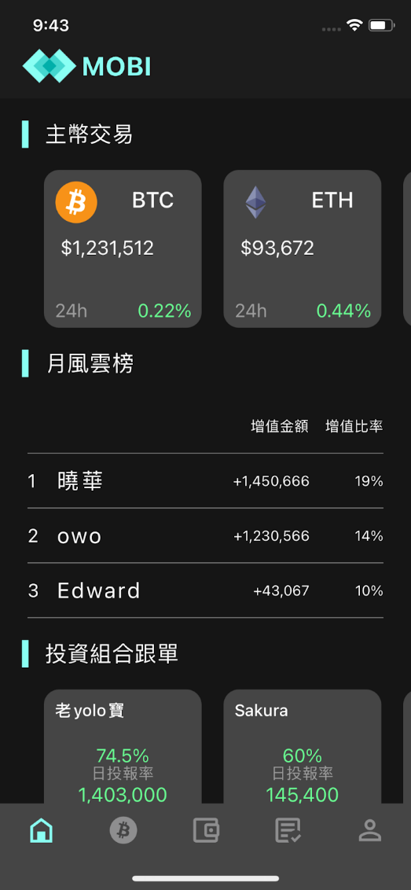
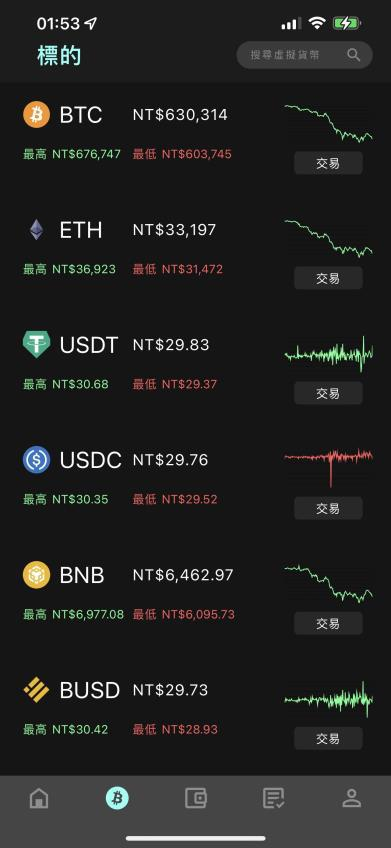
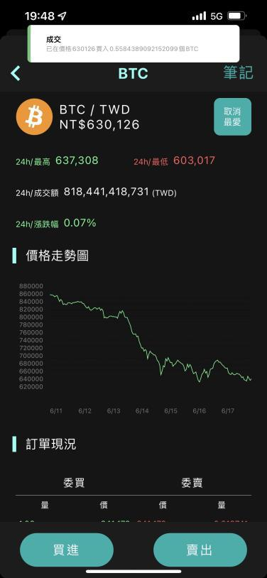
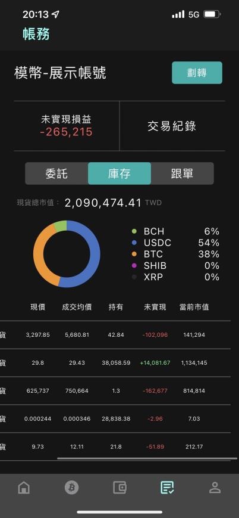
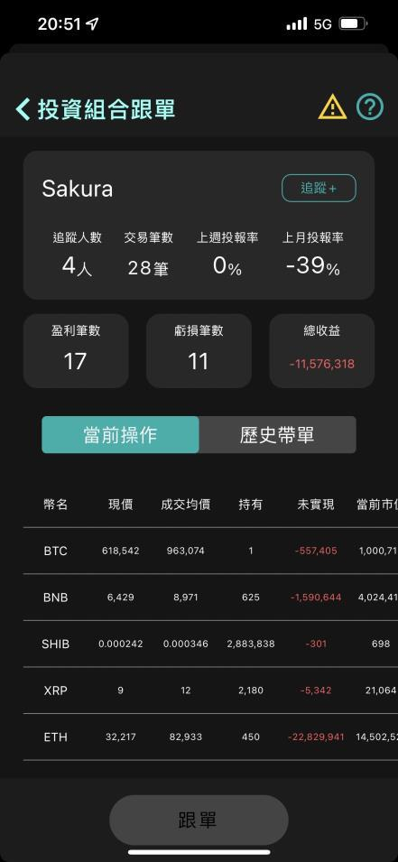
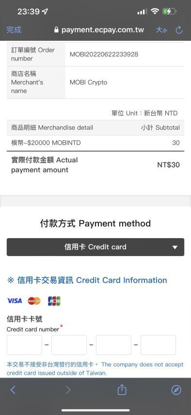
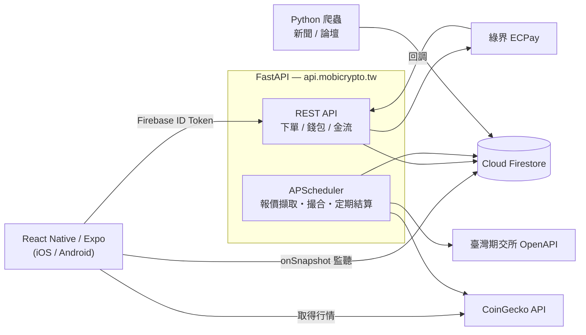

# MOBI（模幣）— 虛擬貨幣模擬交易行動平台

一款以 React Native 開發的行動應用程式，讓使用者在不動用真實資金的前提下體驗虛擬貨幣交易。
實作範圍涵蓋即時行情取得、限價與市價單撮合、跟單交易，以及信用卡金流串接，
是一個從前端到後端完整貫通的團隊開發專案。

[日本語](README.md) | **繁體中文** | [English](README.en.md)

> 輔仁大學資訊管理學系 第三十八屆專題（2021 年 9 月 – 2022 年 6 月）
> 本儲存庫為封存版本，後端伺服器與 Firebase 專案目前均已停止運作。

---

## 畫面截圖

| 首頁 | 幣種列表 | 標的詳情與成交 |
|:---:|:---:|:---:|
|  |  |  |
| 主要幣種、月風雲榜、<br>投資組合跟單推薦 | 即時價格、最高/最低價<br>與迷你走勢圖 | 價格走勢圖、五檔訂單簿<br>與市價單成交通知 |

| 帳務庫存 | 跟單交易 | 綠界金流 |
|:---:|:---:|:---:|
|  |  |  |
| 持倉比例圓餅圖、<br>未實現損益、成交均價 | 交易員績效與<br>當前持倉公開 | 信用卡實際付款<br>（正式環境） |

### 操作示範影片

▶ **[觀看操作示範影片（Google 雲端硬碟）](https://drive.google.com/file/d/1HZUFtQn4ahwxjBWEAVqS0gwkdywZJpnm/view?usp=sharing)**

---

## 專案概要

與股票不同，虛擬貨幣市場 24 小時不間斷交易，對新手而言進入門檻與風險都相當高。
本專案建置一套**連動真實市場價格、但僅以虛擬資金進行交易的模擬器**，
讓使用者能在零成本的情況下累積交易經驗。

新使用者可獲得 15 萬元虛擬台幣，資金不足時可透過觀看廣告或付費儲值補充。
系統不只提供基本買賣功能，更以**自動追隨他人交易的跟單機制**為核心，
讓新手能實際學習進階使用者的投資判斷邏輯。

---

## 技術架構

| 領域 | 使用技術 |
|---|---|
| 行動應用 | React Native 0.64 / Expo SDK 44 / React Navigation 6 |
| 圖表與 UI | react-native-svg-charts / react-native-vector-icons / react-native-toast-message |
| 身分驗證 | Firebase Authentication |
| 資料庫 | Cloud Firestore（NoSQL） |
| 後端 API | Python 3.10 / FastAPI / Uvicorn（含 TLS 終端） |
| 排程 | APScheduler |
| 金流 | 綠界科技 ECPay 信用卡付款 |
| 外部資料 | CoinGecko API（250 檔幣種報價）／臺灣期貨交易所 OpenAPI（匯率） |
| 爬蟲 | Requests + BeautifulSoup（新聞與論壇文章） |
| 廣告 | Google AdMob |

### 系統架構



所有會變動資產的**寫入操作一律經由 FastAPI**，將下單處理與餘額計算集中在伺服器端。
每個請求都會先驗證 Firebase ID Token 才進行處理。

另一方面，帳戶餘額、持倉、委託中訂單與交易紀錄，是由客戶端以 **Firestore 的 `onSnapshot` 即時監聽**。
因為限價單成交（排程每 30 秒撮合）、跟單自動下單等情況，都是**在使用者沒有操作的情況下，由伺服器端非同步變動資產**，
採用監聽機制後，不需輪詢或手動重新整理，變更就能立即反映在畫面上。API 也只需寫入 Firestore，不必在回應中回傳更新後的狀態。

行情資料來自外部 API，無法監聽，因此由客戶端依畫面以不同間隔輪詢 CoinGecko API
（標的詳情 4 秒、幣種列表 10 秒、首頁 15 秒，離開畫面時清除計時器）。後端也為了撮合判定，每 6 秒擷取同一 API。

---

## 主要功能

### 交易
- **市價單／限價單**買賣 —— 可用滑桿依持有資金比例下單，或直接輸入數量
- **撮合處理** —— 每 30 秒掃描未成交的限價單，符合價格條件者成交並重算成交均價
- **委託管理** —— 未成交委託列表與刪單
- **訂單簿** —— 五檔買賣報價、24 小時最高／最低／成交額／漲跌幅
- **價格走勢圖** —— 以 SVG 繪製日線走勢

### 跟單交易（本系統核心功能）
- 公開交易員的**追蹤人數、交易筆數、週／月投報率、盈虧筆數、總收益**
- 可檢視**當前操作**與**歷史帶單紀錄**後再決定是否跟單
- 提供**固定比例**與**固定上限**兩種跟單模式，支援跟單中修改比例與解除跟單
- 被跟單者成交時，自動在跟單者帳戶產生對應委託
- 跟單專用倉的**資金劃轉**功能

### 資產管理
- 持倉**圓餅圖**、現貨總市值、未實現損益、成交均價
- **交易紀錄**可篩選近半日／一日／三日／全部，賣出時另計已實現損益與投報率
- 日／週／月**自動結算**

### 資金取得
- **觀看廣告**獲得虛擬資金（每日十次）
- **綠界信用卡儲值**（正式環境實際扣款，透過回調入帳）

### 其他
- 電子郵件**註冊／登入／忘記密碼**
- 個別標的**筆記**與**加入最愛**
- 首頁顯示**成交量前五標的、月風雲榜、新聞、論壇文章**
- 個人資料編輯、問題回報

---

## 擔當範圍

本人負責的範圍如下。

| 領域 | 擔當 | 內容 |
|---|:---:|---|
| 前端 | **全部** | 全 18 個畫面的 React Native 實作、React Navigation 路由設計、狀態管理、API 串接 |
| 資料庫 | **全部** | Firestore 資料模型設計、集合結構規劃、查詢實作 |
| 後端 | **部分** | 見下方說明 |
| UI 設計 | 非擔當 | 畫面視覺與圖像素材由其他成員負責 |

後端負責的部分：

- **爬蟲** —— 新聞網站與論壇文章的擷取並寫入 Firestore
- **價格與匯率抓取** —— CoinGecko API（250 檔幣種）與臺灣期交所 OpenAPI 的定期取得
- **市價買入** —— 從接單到餘額更新的完整流程
- **錢包與獎勵** —— 資金劃轉、廣告獎勵、補助金、登入獎勵
- **金流** —— 綠界訂單產生、CheckMacValue 處理、回調接收
- **跟單交易** —— 跟單判定與委託連動、解除跟單處理
- **ROI 計算** —— 投資報酬率與損益計算邏輯

---

## 目錄結構

```
.
├── App.js                      # 進入點／導覽定義
├── pages/                      # 畫面元件（共 18 個畫面）
│   ├── HomeScreen.js           #   首頁
│   ├── TargetScreen.js         #   標的列表
│   ├── BillingScreen.js        #   帳務（委託・庫存・跟單）
│   ├── WalletScreen.js         #   錢包
│   ├── ProfileScreen.js        #   個人頁面
│   ├── account/                #   登入・註冊・忘記密碼・編輯
│   ├── billing/                #   交易紀錄・劃轉・儲值・跟單
│   ├── profile/                #   最愛・筆記
│   └── target/                 #   標的詳情・交易選單
├── assets/                     # 樣式、共用函式、Firebase 初始化、圖片
├── fastapi/                    # 後端 API 伺服器
│   ├── main.py                 #   13 個端點 + APScheduler 排程
│   ├── server.py               #   Uvicorn 啟動（TLS）
│   ├── https_redirect.py       #   HTTP → HTTPS 轉址
│   ├── sdk/                    #   綠界金流 SDK
│   └── requirements.txt
├── py/ , py_on_server/         # 新聞與論壇爬蟲
└── docs/screenshots/
```

---

## API 端點

| 方法 | 路徑 | 說明 |
|---|---|---|
| `POST` | `/buy/{type}` | 買入委託（`market`／`limit`） |
| `POST` | `/sell/{type}` | 賣出委託（`market`／`limit`） |
| `POST` | `/del_tran` | 刪除未成交委託 |
| `POST` | `/transfer` | 劃轉資金至跟單倉 |
| `POST` | `/cancel_copy_trade` | 解除跟單 |
| `POST` | `/receive_award` | 領取登入獎勵 |
| `POST` | `/ad_reward` | 領取廣告觀看獎勵 |
| `POST` | `/subvention` | 領取補助金 |
| `POST` | `/exchange_rate` | 取得匯率 |
| `GET` | `/get_payment_html/` | 產生綠界付款表單 |
| `POST` | `/ecpay_callback` | 接收綠界付款結果回調 |

排程工作（APScheduler）：

| 間隔 | 處理內容 |
|---|---|
| 6 秒 | 從 CoinGecko 取得 250 檔幣種報價 |
| 30 秒 | 掃描未成交限價單，符合條件者撮合成交 |
| 1 分鐘 | 從臺灣期交所 OpenAPI 取得匯率 |
| 每日／每週／每月 | 損益結算與排行榜統計 |

---

## 環境建置

執行需要另行準備 Firebase 專案與綠界特約商店帳號，本儲存庫不包含任何金鑰。

### 行動應用

```bash
npm install --legacy-peer-deps
npx expo start
```

請將 `assets/database.js` 中的 Firebase 設定替換為自己專案的設定。

### 後端

```bash
cd fastapi
pip install -r requirements.txt
cp ../.env.example .env    # 填入各項數值
python server.py
```

所需環境變數請參考 [`.env.example`](.env.example)：

| 變數 | 用途 |
|---|---|
| `FIREBASE_CREDENTIALS` | Firebase Admin SDK 服務帳戶金鑰檔路徑 |
| `ECPAY_MERCHANT_ID` / `ECPAY_HASH_KEY` / `ECPAY_HASH_IV` | 綠界特約商店資訊 |
| `SSL_KEYFILE` / `SSL_CERTFILE` | TLS 憑證（以 Uvicorn 終端 HTTPS 時使用） |

---

## 補充與限制

- 本儲存庫為 **2022 年當時程式碼的封存版本**。後端（`api.mobicrypto.tw`）與 Firebase 專案目前均已停止運作。
- Expo SDK 44 與 React Native 0.64 皆已終止支援，執行需搭配 Node 16。
- 公開前已將原本寫死在程式碼中的**服務帳戶金鑰、金流金鑰、TLS 私鑰全數移除並改為環境變數**。
- `py/` 與 `py_on_server/` 為開發當時成員各自持有的爬蟲本機版本。

---

## 授權

[MIT License](LICENSE)
